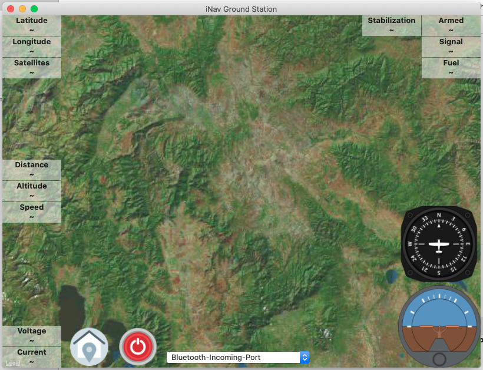

# iNavTelemetry
iNav telemetry for iOS (iPhone / iPad / MacOS)

# iPhone

# iPad

# MacOS

# Signal Inverter used

# Support Protocol
- FrSky Smart Port 
- Custom Telemetry - check example of [Tracker](https://github.com/zosko/R9M_Inav_antenna_tracker/blob/master/bt_r9m_accst/bt_r9m_accst.ino)
