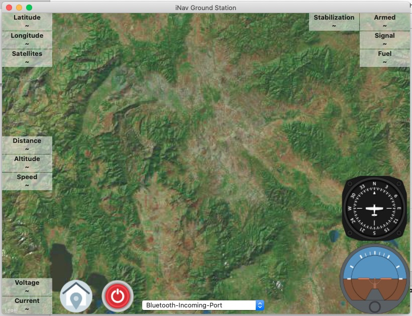
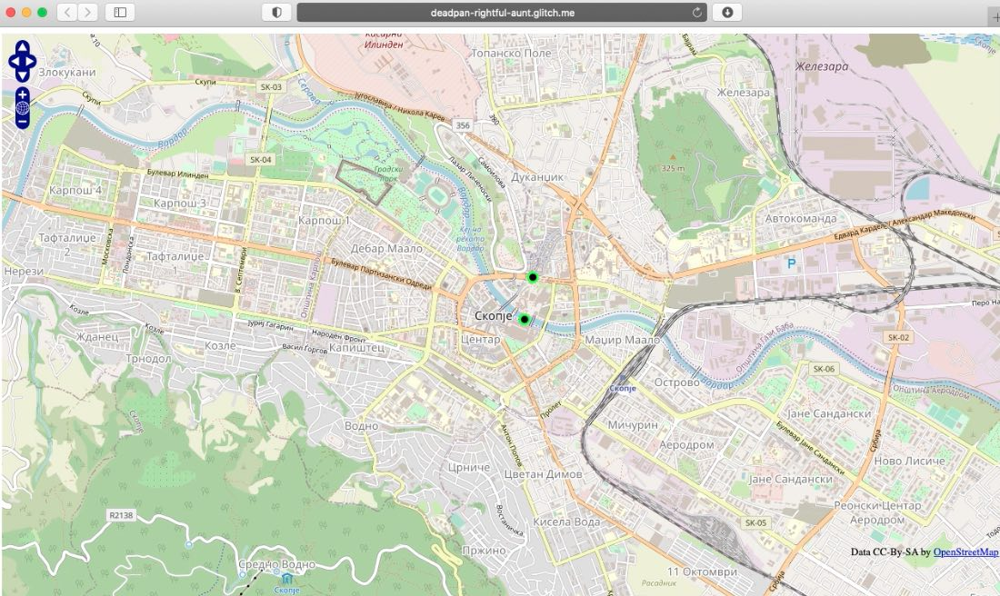

  

**Thanks for supporters:** gdanas87, Jeremy

# Available on AppStore 
https://apps.apple.com/us/app/inav-telemetry/id1543244904

# What is iNavTelemetry
Its application to read telementry from iNav flight controllers. Designed for Apple devices like iPhone / iPad / MacOS. Later maybe for others.

You can watch other realtime on iPhone/iPad or web:
https://deadpan-rightful-aunt.glitch.me

# Supported Protocol
- **Custom Telemetry** - check example of [Tracker](https://github.com/zosko/R9M_Inav_antenna_tracker/blob/master/bt_r9m_accst/bt_r9m_accst.ino)
- **FrSky Smart Port** 
- **Multiwii Serial Protocol** (MSP)
- **Crossfire** (by request if need)
- **MAVLink** (by request if need)
- **LTM** (by request if need)

# Setup on iNav flight controller in CLI
- smartport_fuel_unit = PERCENT
- frsky_pitch_roll = ON

# Screenshots / Videos
Application (youtube)|Browser Viewer (youtube)
----------|----------
|
iPhone|iPad
|
MacOS|Browser
||

# How to use on Frsky R9 module if you dont have build in Bluetooth Module
In order this to work you need additional hardware: inverter and bluetooth module (HC-05 or HC-06 or something else, also you don't need module and inverter if your transmitter has internal one) One important thing: Module should be configured to work on 57600 baud rate, otherwise it won't work. Connect inverter to your Smart Port and then connect bluetooth module to the inverter. You now can connect your phone to your bluetooth module and view data

# Signal Inverter used for Frsky R9 module

