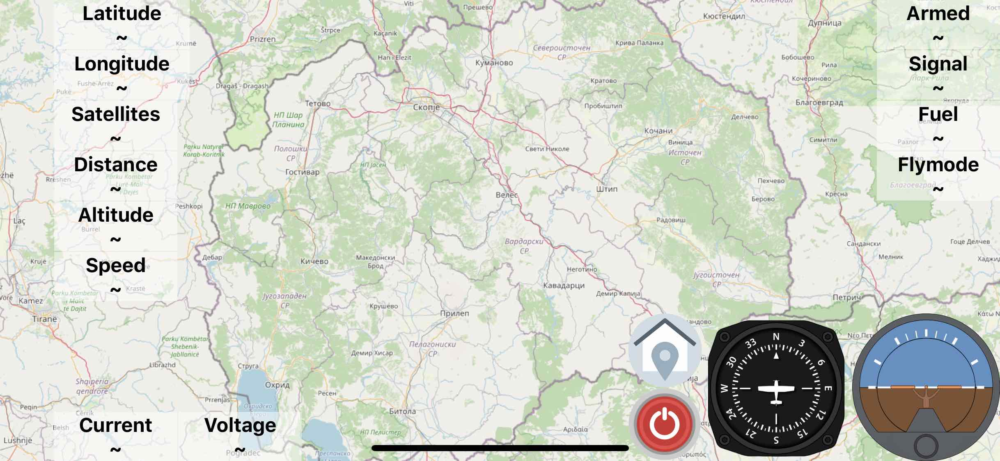
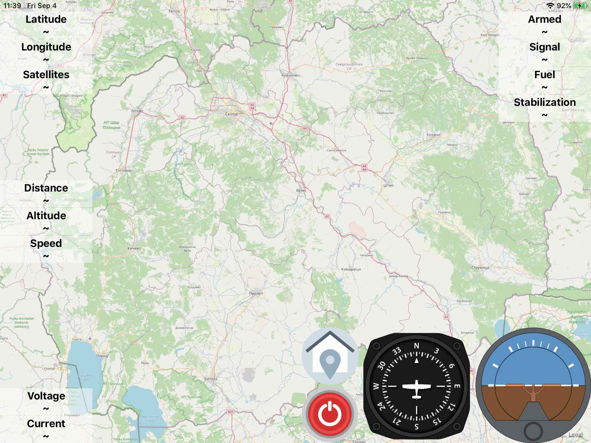

# iNavTelemetry
iNav telemetry for iOS (iPhone / iPad / MacOS / Safari Viewer)

# Setup on iNav flight controller
- smartport_fuel_unit = PERCENT
- frsky_pitch_roll = ON

# Video presentation application

# Video presentation viewer

# iPhone

# iPad

# MacOS

# Browser Viewer - watch online pilots on browser

# Signal Inverter used

# Support Protocol
- FrSky Smart Port 
- Custom Telemetry - check example of [Tracker](https://github.com/zosko/R9M_Inav_antenna_tracker/blob/master/bt_r9m_accst/bt_r9m_accst.ino)
